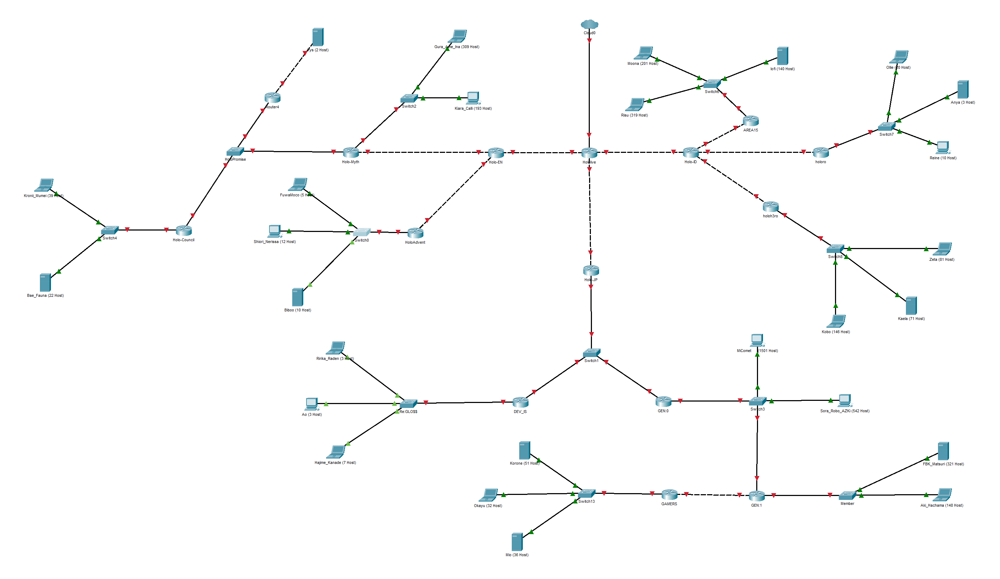

# Jarkom-Modul-3-IT21-2024

|Nama  | NRP |
|--|--|
| Nathan Kho Pancras | 5027231002 |
| Muhammad Andrean Rizq Prasetio | 5027231052 |

## Daftar Isi

- [Jarkom-Modul-3-IT21-2024](#jarkom-modul-3-it21-2024)
  - [Daftar Isi](#daftar-isi)
- [Prerequisites](#prerequisites)
  - [Topologi Awal](#topologi-awal)
  - [Proses Subnetting](#proses-subnetting)
  - [Rute](#rute)
- [VLSM](#vlsm)
  - [VLSM Tree](#vlsm-tree)
  - [Pembagian IP](#pembagian-ip)
  - [Konfigurasi](#konfigurasi)
  - [Routing](#routing)
  - [Testing](#testing)
- [CIDR](#cidr)
  - [Penggabungan IP](#penggabungan-ip)
  - [CIDR Tree](#cidr-tree)
  - [Pembagian IP](#pembagian-ip-1)
  - [Konfigurasi](#konfigurasi-1)
  - [Routing](#routing-1)
  - [Testing](#testing-1)

# Prerequisites

**NOTE:** Kelompok kami (IP prefix 10.74) menggunakan kombinasi:

- `GNS3` + VLSM
- `CPT` + CIDR

## Topologi Awal

## Proses Subnetting

## Rute

| Nama Subnet | Rute | Jumlah IP | Netmask |
|-------------|------|-----------|---------|
| A1          | Hololive > HoloEN | 2         | /30     |
| A2          | Hololive > HoloEN > Holo-Myth | 2         | /30     |
| A3          | Hololive > HoloEN > Holo-Myth > Switch2 > Gur-ame-ina / Calli-ara | 503       | /23     |
| A4          | Hololive > HoloEN > Holo-Myth > HoloPromise > Project-Hope / Holo-Council | 3         | /29     |
| A5          | Hololive > HoloEN > Holo-Myth > HoloPromise > Project-Hope > Irys | 3         | /29     |
| A6          | Hololive > HoloEN > Holo-Myth > HoloPromise > Holo-Council > Switch4 > Kronii / Fauna | 62        | /26     |
| A7          | Hololive > HoloEN > HoloAdvent | 2         | /30     |
| A8          | Hololive > HoloEN > HoloAdvent > Switch > Fuwa / Shiori / Biboo | 28        | /27     |
| A9          | Hololive > HoloID | 2         | /30     |
| A10         | Hololive > HoloID > Area15 | 2         | /30     |
| A11         | Hololive > HoloID > Area15 > Switch6 > Moona / Risu / Iofi | 661       | /22     |
| A12         | Hololive > HoloID > holoro | 2         | /30     |
| A13         | Hololive > HoloID > holoro > Switch7 > Ollie / Anya / Reine | 34        | /26     |
| A14         | Hololive > HoloID > holoh3ro | 2         | /30     |
| A15         | Hololive > HoloID > holoh3ro > Switch8 > Zeta / Kaela / Kobo | 299       | /23     |
| A16         | Hololive > HoloJP | 2         | /30     |
| A17         | Hololive > HoloJP > Switch1 > DEV_IS / GEN:0 | 3         | /29     |
| A18         | Hololive > HoloJP > Switch1 > DEV_IS > Re:GLOSS > Ririka / Ao / Kanade | 14        | /28     |
| A19         | Hololive > HoloJP > Switch1 > GEN:0 > Switch 3 > MiComet / AZKi / GEN:1 | 2045      | /21     |
| A20         | Hololive > HoloJP > Switch1 > GEN:0 > Switch 3 > GEN:1 > Member > Matsuri / Haachama | 470       | /23     |
| A21         | Hololive > HoloJP > Switch1 > GEN:0 > Switch 3 > GEN:1 > GAMERS | 2         | /30     |
| A22         | Hololive > HoloJP > Switch1 > GEN:0 > Switch 3 > GEN:1 > GAMERS > Fubuki > Korone / Okayu / Mio | 120       | /25     |
| **Total**   |                      | **4263**  | **/19** |

# VLSM

## VLSM Tree

## Pembagian IP

| Subnet | Network ID  | Netmask          | Broadcast    | Range IP                     |
|--------|-------------|------------------|--------------|------------------------------|
| A1     | 10.74.19.72 | 255.255.255.252  | 10.74.19.75  | 10.74.19.73 - 10.74.19.74    |
| A2     | 10.74.19.76 | 255.255.255.252  | 10.74.19.79  | 10.74.19.77 - 10.74.19.78    |
| A3     | 10.74.12.0  | 255.255.254.0    | 10.74.13.255 | 10.74.12.1 - 10.74.13.254    |
| A4     | 10.74.19.48 | 255.255.255.248  | 10.74.19.55  | 10.74.19.49 - 10.74.19.54    |
| A5     | 10.74.19.56 | 255.255.255.248  | 10.74.19.63  | 10.74.19.57 - 10.74.19.62    |
| A6     | 10.74.18.128| 255.255.255.192  | 10.74.18.191 | 10.74.18.129 - 10.74.18.190  |
| A7     | 10.74.19.80 | 255.255.255.252  | 10.74.19.83  | 10.74.19.81 - 10.74.19.82    |
| A8     | 10.74.19.0  | 255.255.255.224  | 10.74.19.31  | 10.74.19.1 - 10.74.19.30     |
| A9     | 10.74.19.84 | 255.255.255.252  | 10.74.19.87  | 10.74.19.85 - 10.74.19.86    |
| A10    | 10.74.19.88 | 255.255.255.252  | 10.74.19.91  | 10.74.19.89 - 10.74.19.90    |
| A11    | 10.74.8.0   | 255.255.252.0    | 10.74.11.255 | 10.74.8.1 - 10.74.11.254     |
| A12    | 10.74.19.92 | 255.255.255.252  | 10.74.19.95  | 10.74.19.93 - 10.74.19.94    |
| A13    | 10.74.18.192| 255.255.255.192  | 10.74.18.255 | 10.74.18.193 - 10.74.18.254  |
| A14    | 10.74.19.96 | 255.255.255.252  | 10.74.19.99  | 10.74.19.97 - 10.74.19.98    |
| A15    | 10.74.14.0  | 255.255.254.0    | 10.74.15.255 | 10.74.14.1 - 10.74.15.254    |
| A16    | 10.74.19.100| 255.255.255.252  | 10.74.19.103 | 10.74.19.101 - 10.74.19.102  |
| A17    | 10.74.19.64 | 255.255.255.248  | 10.74.19.71  | 10.74.19.65 - 10.74.19.70    |
| A18    | 10.74.19.32 | 255.255.255.240  | 10.74.19.47  | 10.74.19.33 - 10.74.19.46    |
| A19    | 10.74.0.0   | 255.255.248.0    | 10.74.7.255  | 10.74.0.1 - 10.74.7.255      |
| A20    | 10.74.16.0  | 255.255.254.0    | 10.74.17.255 | 10.74.16.1 - 10.74.17.254    |
| A21    | 10.74.19.104| 255.255.255.252  | 10.74.19.107 | 10.74.19.105 - 10.74.19.106  |
| A22    | 10.74.18.0  | 255.255.255.128  | 10.74.18.127 | 10.74.18.1 - 10.74.18.127    |

## Konfigurasi

## Routing

## Testing

# CIDR

## Penggabungan IP

## CIDR Tree

## Pembagian IP

## Konfigurasi

## Routing

## Testing